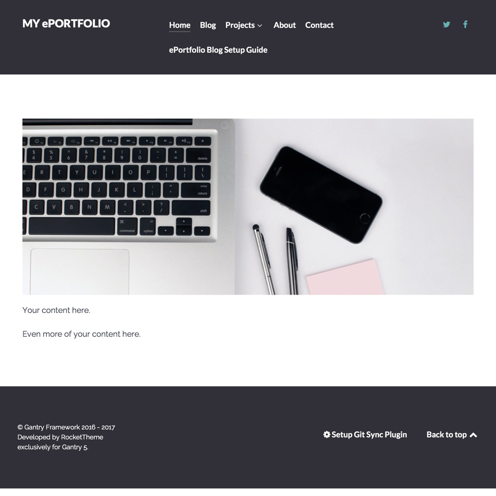

# Grav Gantry ePortfolio Blog with Git Sync Skeleton

[](http://demo.hibbittsdesign.org/grav-eportfolio-blog)
[](https://github.com/hibbitts-design/grav-skeleton-eportfolio-blog/blob/master/LICENSE)

[](https://chat.getgrav.org)

The *ePortfolio Blog with Git Sync* skeleton package is designed to give tech-savvy students complete control of their content and publishing workflow using modern open Web services. By default, this package uses the [Gantry](http://gantry.org/) theme Helium.



# Why might you want to use the Grav ePortfolio Blog Project?
* To quickly leverage a modern flat-file CMS (i.e. Grav) for the creation and presentation of your ePortfolio blog
* To make your ePortfolio blog content future-ready by mirroring all ePortfolio blog pages on the Git service (e.g. GitHub) of your choice
* To quickly and easily update your ePortfolio blog online or locally using the tools of your choice
* To provide a mobile and multi-device friendly visual presentation of your ePortfolio blog
* To easily customize the presentation of your ePortfolio blog using a visual theme builder (i.e. Gantry 5)
* To be able to easily backup and move your ePortfolio blog to just about any Webhost server

# ePortfolio Blog Highlights
* [Git Sync Plugin](https://github.com/trilbymedia/grav-plugin-git-sync) for Grav pre-installed
* [View Git Sync Repository](https://github.com/hibbitts-design/grav-gantry5-particle-view-git-sync-repo) for Gantry pre-installed
* [Hypothesis Particle](https://github.com/hibbitts-design/grav-gantry5-particle-hypothesis) for Gantry pre-installed
* Markdown (and optionally HTML) page content
* Full-width and pages with a right sidebar are supported
* Sidebar is a standard Grav page, which can also contain HTML
* [Gantry 5](http://gantry.org/) visual theme builder included
* Two responsive Gantry 5 themes (Hydrogen and Helium) pre-configured

# Installing the ePortfolio Blog with Git Sync Site
## Web Install
**Pre-flight Checklist**  
1. Confirm Webserver PHP version (PHP 5.5.9 or higher)  
2. Webserver login credentials (username and password)  
3. Git version 1.7.1 or higher installed on your Webserver

**Installation Steps**  
1. Download the ready-to-run [ePortfolio Blog with Git Sync Skeleton Package](http://hibbittsdesign.org/blog/downloads/grav-skeleton-eportfolio-blog-site.zip)  
2. Unzip the package onto your desktop  
3. Copy the _entire_ Grav Course Hub folder to your Webserver  
4. Point your browser to the Webserver folder  
5. Create your site administrator account when prompted  
6. And you're done! (press the  icon in the Admin Panel to preview site)  

## Git Sync Configuration
On the bottom of your site pages there will be a reminder displayed to enable GitHub/GitLab syncing of your site content. Tp on the ```Setup Git Sync Plugin``` link and complete the displayed setup wizard.

## ePortfolio Blog with Git Sync Setup Walkthrough
[](http://www.youtube.com/watch?v=U0JeGfCexdY "ePortfolio Blog with Git Sync Setup Walkthrough ")  

## Suggested Next Steps
* Explore the Grav documentation at [learn.getgrav.org](http://learn.getgrav.org )
* Visit the [Page panel](../../admin/pages) to edit and create pages in your site
* Check out the available [Gantry theme settings](../../admin/gantry/)
* Learn about the included [Gantry 5 Framework](http://docs.gantry.org/)

## Want to edit your ePortfolio on your Mac or Windows computer when using GitHub? Here's how:
1. Download and install [GitHub Desktop](https://desktop.github.com/)
2. Go to your GitHub repository and tap on the `Clone or download` dropdown button, and then choose `Open in Desktop`
3. Choose the location of your local GitHub repository
4. And you are done!

You can now edit your ePortfolio Blog pages locally using the text editor of your choice (i.e. [Atom](https://atom.io/) or [Adobe Brackets](http://brackets.io/)). To upload any changes back to your repository and live site, use the `Sync` and `Publish` buttons in GitHub Desktop. Interested in learning more? Visit the [GitHub Desktop Documentation](https://help.github.com/desktop/).

# Configuration Options
## View Git Sync Repository


## Gantry 5 Layout Manager

_Image courtesy of [gantry.org](http://gantry.org/)_
